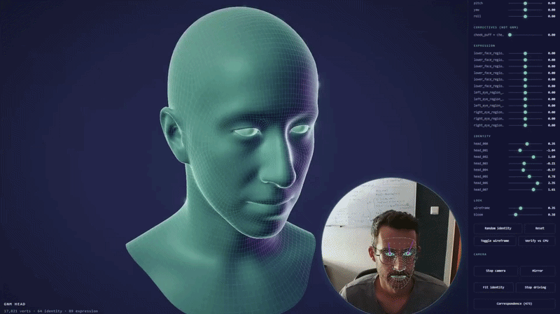

# GNM Webcam Puppet

Turn your face into a 3D character, live, in your browser. No app to install,
no account, no server — point a webcam at yourself and a 3D head follows your
expressions and head movements in real time.



Built on [GNM Head](https://github.com/google/GNM), Google's open-source
parametric model of a human head/face.

## Try it: the browser version

**[`web_puppet/`](web_puppet/)** is the one to run — everything is rendered
on your GPU inside the page, so it's fast, it's the good-looking version (see
the gif above), and there is nothing to install beyond Node for the one-time
build.

```bash
cd web_puppet
npm install
npm run sync-assets   # first time only: fetches the face-tracking model
npm run dev           # open http://localhost:5173
```

Click **Start camera**, hold still for a neutral expression, click **Fit
identity**, then **Drive head** — the 3D head now follows your face. See
[`web_puppet/README.md`](web_puppet/README.md) for the full build log and
every design decision behind it.

There's also **[`webcam_puppet/`](webcam_puppet/)**, a Python desktop version
of the same idea — the earlier prototype this was rebuilt from, useful if you
want to poke at the tracking/solving code without a browser toolchain.

## How it works

Nothing here needs a face scan or any manual rigging — the whole pipeline
runs on an ordinary laptop webcam, in real time, from three ingredients:

**1. A 3D head that's controlled by numbers.** GNM Head is a *parametric*
model: instead of drawing a face, you hand it a list of numbers and it hands
back a 3D mesh. Some numbers control **identity** (is the face narrow or
wide, is the nose long or short, ...), some control **expression** (smile,
frown, mouth open, ...), and a few control **pose** (how the head is
rotated). Change the numbers, the face changes — this is exactly what makes
the head "drivable."

**2. Reading your face from the webcam.** Every video frame is handed to
[MediaPipe](https://ai.google.dev/edge/mediapipe), which runs a
neural network *inside the browser* (compiled to WebAssembly — nothing is
uploaded anywhere) and returns 478 points tracing out your eyes, brows, lips
and face outline, plus an estimate of how your head is rotated.

**3. Turning those points into GNM's numbers.** This happens in two stages:

   - **Once, when you click "Fit identity":** your face's 478 tracked points
     are matched against the ~473 of them that correspond to specific points
     on the GNM mesh, and a least-squares solve picks the identity numbers
     that make the mesh's shape line up with yours. This is a rough,
     one-time "sizing" step — it only needs to happen once per person.
   - **Every frame, once identity is known:** whatever is left over once your
     personal face shape is accounted for — an open mouth, a raised brow, a
     turned head — is solved into expression and pose numbers. This is what
     runs 30 times a second while you make faces at the camera.

**4. Rendering.** The identity/expression/pose numbers are fed into GNM's
math (a sum of pre-trained "basis" shapes, essentially the model's version of
"if you're smiling, add this much of the *smile* shape") and evaluated
directly on the GPU, so the 3D head redraws itself at full frame rate with
room to spare for the stylized lighting, rim glow and wireframe look you see
in the gif.

```
 webcam ──▶ MediaPipe face tracking ──▶ landmark points
                                              │
                          ┌───────────────────┴───────────────────┐
                          │                                       │
                 once: fit identity                      every frame: fit
               (your face's proportions)         expression + head pose
                          │                                       │
                          └───────────────────┬───────────────────┘
                                               ▼
                                  GNM parameters (identity, expression, pose)
                                               │
                                               ▼
                                GNM forward pass, evaluated on the GPU
                                               │
                                               ▼
                                    3D head rendered in the page
```

Everything — tracking, solving and rendering — runs client-side. The camera
feed never leaves your machine.

## Repository layout

| Directory | What it is |
| --- | --- |
| [`web_puppet/`](web_puppet/README.md) | **Start here.** Browser version — TypeScript + WebGL, runs client-side, no Python at runtime |
| [`webcam_puppet/`](webcam_puppet/README.md) | Python desktop version — the earlier prototype, useful for hacking on the tracking/solving code directly |

Neither directory modifies or vendors the GNM package itself; both depend on
it via `pip install gnm-shape` (or `pip install -e ./gnm/shape` from a GNM
checkout) for the Python side, and via the exported assets built by
`web_puppet/tools/export_assets.py` for the browser side.

## License

Apache 2.0 — see [LICENSE](LICENSE).
